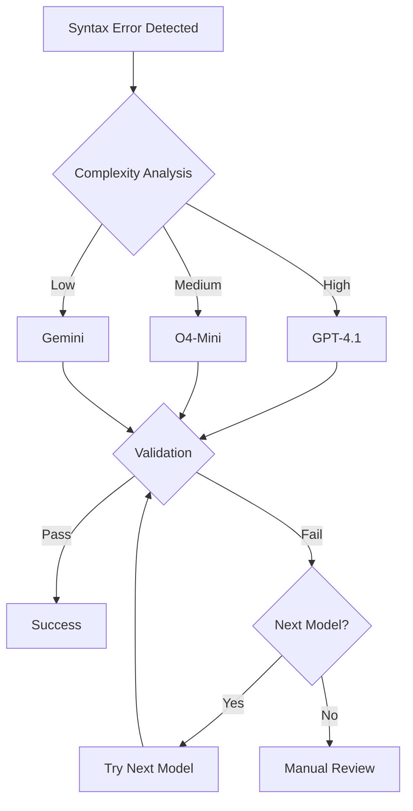

# AI Orchestration Documentation

**Copyright (c) 2025 davidgornshtein@gmail.com**  
**Licensed for non-commercial use only. For commercial use, please contact davidgornshtein@gmail.com**

## Overview

The AI orchestration system in this project represents a sophisticated multi-model approach to code analysis and transformation. It demonstrates how different AI models can be combined effectively to solve complex parsing and syntax correction challenges at scale.

## Architecture

### Model Hierarchy

```
Primary Model (GPT-4.1)
    ├── High accuracy for complex syntax
    ├── Best understanding of context
    └── Higher cost per request

Secondary Model (O4-Mini)
    ├── Good balance of speed/accuracy
    ├── Efficient for medium complexity
    └── Lower cost than GPT-4.1

Tertiary Model (Gemini)
    ├── Fast processing
    ├── Good for simple patterns
    └── Lowest cost option
```

### Decision Flow



## Implementation Details

### 1. Error Context Extraction

```javascript
function extractErrorContext(code, error) {
    const lines = code.split('\n');
    const errorLine = error.loc?.line || 0;
    const contextSize = 10;
    
    return {
        error: error.message,
        line: errorLine,
        context: lines.slice(
            Math.max(0, errorLine - contextSize),
            Math.min(lines.length, errorLine + contextSize)
        ).join('\n'),
        fullError: error
    };
}
```

### 2. Model Selection Strategy

```javascript
class ModelSelector {
    constructor() {
        this.models = [
            { 
                name: 'GPT-4.1',
                scoreThreshold: 0.7,
                patterns: ['complex regex', 'nested functions', 'async patterns']
            },
            { 
                name: 'O4-Mini',
                scoreThreshold: 0.4,
                patterns: ['function signatures', 'basic syntax', 'imports']
            },
            { 
                name: 'Gemini',
                scoreThreshold: 0.0,
                patterns: ['simple replacements', 'character fixes']
            }
        ];
    }
    
    selectModel(error, code) {
        const complexity = this.calculateComplexity(error, code);
        
        for (const model of this.models) {
            if (complexity >= model.scoreThreshold) {
                return model;
            }
        }
        
        return this.models[this.models.length - 1];
    }
    
    calculateComplexity(error, code) {
        let score = 0;
        
        // Error type scoring
        if (error.message.includes('Unexpected token')) score += 0.3;
        if (error.message.includes('Invalid regular expression')) score += 0.5;
        if (error.message.includes('Missing')) score += 0.2;
        
        // Code complexity scoring
        const lines = code.split('\n').length;
        if (lines > 100) score += 0.2;
        if (lines > 500) score += 0.3;
        
        // Pattern complexity
        if (/[\[\]{}()<>]/.test(error.context)) score += 0.1;
        if (/async|await|Promise/.test(error.context)) score += 0.2;
        
        return Math.min(score, 1.0);
    }
}
```

### 3. Prompt Engineering

#### GPT-4.1 Prompt Template

```javascript
const gpt4Prompt = `You are a JavaScript syntax expert. Fix the following syntax error:

Error: ${error.message}
Line: ${error.line}

Context:
\`\`\`javascript
${error.context}
\`\`\`

Full file:
\`\`\`javascript
${code}
\`\`\`

Rules:
1. Fix ONLY the specific syntax error
2. Preserve all logic and functionality
3. Maintain consistent code style
4. Return ONLY the complete fixed code

Fixed code:`;
```

#### O4-Mini Prompt Template

```javascript
const o4MiniPrompt = `Fix this JavaScript syntax error.

Error: ${error.message}

Code section with error:
\`\`\`javascript
${error.context}
\`\`\`

Return the complete fixed code maintaining all original functionality.`;
```

#### Gemini Prompt Template

```javascript
const geminiPrompt = `JavaScript syntax fix needed:
Error: ${error.message}
Fix the code and return the complete corrected version.

${code}`;
```

### 4. Parallel Processing Architecture

```javascript
class ParallelProcessor {
    constructor(options = {}) {
        this.batchSize = options.batchSize || 20;
        this.maxConcurrent = options.maxConcurrent || 5;
        this.queue = [];
        this.processing = new Set();
    }
    
    async processFiles(files) {
        const batches = this.createBatches(files);
        const results = [];
        
        for (const batch of batches) {
            const batchResults = await Promise.all(
                batch.map(file => this.processFile(file))
            );
            results.push(...batchResults);
            
            // Checkpoint after each batch
            await this.saveCheckpoint(results);
        }
        
        return results;
    }
    
    createBatches(items) {
        const batches = [];
        for (let i = 0; i < items.length; i += this.batchSize) {
            batches.push(items.slice(i, i + this.batchSize));
        }
        return batches;
    }
}
```

### 5. Validation Pipeline

```javascript
class ValidationPipeline {
    constructor() {
        this.validators = [
            this.syntaxValidation,
            this.semanticValidation,
            this.integrationValidation
        ];
    }
    
    async validate(code, originalError) {
        for (const validator of this.validators) {
            const result = await validator(code, originalError);
            if (!result.valid) {
                return result;
            }
        }
        return { valid: true };
    }
    
    async syntaxValidation(code) {
        try {
            parse(code, {
                sourceType: 'module',
                plugins: [
                    'jsx',
                    'typescript',
                    'decorators-legacy',
                    'classProperties',
                    'dynamicImport',
                    'nullishCoalescingOperator',
                    'optionalChaining'
                ]
            });
            return { valid: true };
        } catch (error) {
            return { valid: false, error };
        }
    }
    
    async semanticValidation(code) {
        // Check for common semantic issues
        const checks = [
            { pattern: /module\.exports\s*=/, required: true },
            { pattern: /function\s+\w+/, required: false },
            { pattern: /require\(['"]\w+['"]\)/, required: false }
        ];
        
        for (const check of checks) {
            if (check.required && !check.pattern.test(code)) {
                return { valid: false, error: 'Missing required pattern' };
            }
        }
        
        return { valid: true };
    }
}
```

## Performance Optimization

### 1. Request Batching

```javascript
class RequestBatcher {
    constructor(model, options = {}) {
        this.model = model;
        this.batchSize = options.batchSize || 10;
        this.timeout = options.timeout || 100;
        this.queue = [];
        this.timer = null;
    }
    
    async add(request) {
        return new Promise((resolve, reject) => {
            this.queue.push({ request, resolve, reject });
            this.scheduleBatch();
        });
    }
    
    scheduleBatch() {
        if (this.timer) clearTimeout(this.timer);
        
        if (this.queue.length >= this.batchSize) {
            this.processBatch();
        } else {
            this.timer = setTimeout(() => this.processBatch(), this.timeout);
        }
    }
    
    async processBatch() {
        const batch = this.queue.splice(0, this.batchSize);
        if (batch.length === 0) return;
        
        try {
            const results = await this.model.batchProcess(
                batch.map(item => item.request)
            );
            
            batch.forEach((item, index) => {
                item.resolve(results[index]);
            });
        } catch (error) {
            batch.forEach(item => item.reject(error));
        }
    }
}
```

### 2. Cache Strategy

```javascript
class AIResponseCache {
    constructor() {
        this.cache = new Map();
        this.stats = {
            hits: 0,
            misses: 0,
            size: 0
        };
    }
    
    generateKey(code, error) {
        const hash = crypto.createHash('sha256');
        hash.update(code);
        hash.update(error.message);
        return hash.digest('hex');
    }
    
    async get(code, error) {
        const key = this.generateKey(code, error);
        const cached = this.cache.get(key);
        
        if (cached) {
            this.stats.hits++;
            return cached;
        }
        
        this.stats.misses++;
        return null;
    }
    
    set(code, error, result) {
        const key = this.generateKey(code, error);
        this.cache.set(key, result);
        this.stats.size = this.cache.size;
    }
}
```

## Monitoring and Analytics

### 1. Model Performance Tracking

```javascript
class ModelPerformanceTracker {
    constructor() {
        this.metrics = new Map();
    }
    
    record(model, success, duration, complexity) {
        if (!this.metrics.has(model)) {
            this.metrics.set(model, {
                attempts: 0,
                successes: 0,
                totalDuration: 0,
                complexitySum: 0
            });
        }
        
        const stats = this.metrics.get(model);
        stats.attempts++;
        if (success) stats.successes++;
        stats.totalDuration += duration;
        stats.complexitySum += complexity;
    }
    
    getReport() {
        const report = {};
        
        for (const [model, stats] of this.metrics) {
            report[model] = {
                successRate: stats.successes / stats.attempts,
                avgDuration: stats.totalDuration / stats.attempts,
                avgComplexity: stats.complexitySum / stats.attempts,
                totalAttempts: stats.attempts
            };
        }
        
        return report;
    }
}
```

### 2. Error Pattern Analysis

```javascript
class ErrorPatternAnalyzer {
    constructor() {
        this.patterns = new Map();
    }
    
    analyze(error, fixApplied) {
        const pattern = this.extractPattern(error);
        
        if (!this.patterns.has(pattern)) {
            this.patterns.set(pattern, {
                count: 0,
                fixes: new Map()
            });
        }
        
        const stats = this.patterns.get(pattern);
        stats.count++;
        
        if (fixApplied) {
            const fixCount = stats.fixes.get(fixApplied) || 0;
            stats.fixes.set(fixApplied, fixCount + 1);
        }
    }
    
    extractPattern(error) {
        // Normalize error message to identify patterns
        return error.message
            .replace(/line \d+/gi, 'line N')
            .replace(/column \d+/gi, 'column N')
            .replace(/'[^']+'/g, "'X'")
            .replace(/"[^"]+"/g, '"X"');
    }
    
    getTopPatterns(limit = 10) {
        return Array.from(this.patterns.entries())
            .sort((a, b) => b[1].count - a[1].count)
            .slice(0, limit)
            .map(([pattern, stats]) => ({
                pattern,
                count: stats.count,
                topFixes: Array.from(stats.fixes.entries())
                    .sort((a, b) => b[1] - a[1])
                    .slice(0, 3)
            }));
    }
}
```

## Best Practices

### 1. Error Handling

```javascript
class AIErrorHandler {
    async handleError(error, context) {
        // Categorize error
        const category = this.categorizeError(error);
        
        switch (category) {
            case 'rate_limit':
                return this.handleRateLimit(error, context);
            case 'timeout':
                return this.handleTimeout(error, context);
            case 'invalid_response':
                return this.handleInvalidResponse(error, context);
            default:
                return this.handleGenericError(error, context);
        }
    }
    
    categorizeError(error) {
        if (error.message.includes('rate limit')) return 'rate_limit';
        if (error.message.includes('timeout')) return 'timeout';
        if (error.message.includes('invalid')) return 'invalid_response';
        return 'generic';
    }
    
    async handleRateLimit(error, context) {
        const backoff = this.calculateBackoff(context.attempts);
        await this.delay(backoff);
        return { retry: true, delay: backoff };
    }
    
    calculateBackoff(attempts) {
        return Math.min(1000 * Math.pow(2, attempts), 60000);
    }
}
```

### 2. Quality Assurance

```javascript
class QualityAssurance {
    async verifyFix(original, fixed, error) {
        const checks = [
            this.checkSyntaxFixed,
            this.checkNoRegressions,
            this.checkStyleConsistency,
            this.checkSemanticEquivalence
        ];
        
        for (const check of checks) {
            const result = await check(original, fixed, error);
            if (!result.passed) {
                return result;
            }
        }
        
        return { passed: true };
    }
}
```

## Integration with Claude Code

### 1. Model Provider Interface

```javascript
class ClaudeCodeAIProvider {
    constructor(config) {
        this.models = {
            'gpt-4.1': new GPT4Provider(config.gpt4),
            'o4-mini': new O4MiniProvider(config.o4mini),
            'gemini': new GeminiProvider(config.gemini)
        };
    }
    
    async complete(prompt, options = {}) {
        const model = this.models[options.model || 'gpt-4.1'];
        return model.complete(prompt, options);
    }
    
    async stream(prompt, options = {}) {
        const model = this.models[options.model || 'gpt-4.1'];
        return model.stream(prompt, options);
    }
}
```

### 2. Tool Integration

```javascript
class AIFixTool {
    constructor() {
        this.name = 'ai_fix';
        this.description = 'Fix code syntax using AI models';
    }
    
    async execute(params) {
        const { code, error } = params;
        const orchestrator = new AIOrchestrator();
        
        return orchestrator.fixCode(code, error);
    }
}
```

## Future Enhancements

### 1. Model Fine-tuning

- Collect successful fixes as training data
- Fine-tune models on specific error patterns
- Create specialized models for different languages

### 2. Predictive Analysis

- Predict which model will succeed based on error type
- Pre-emptively batch similar errors
- Optimize model selection dynamically

### 3. Distributed Processing

- Implement distributed queue system
- Scale across multiple machines
- Real-time progress monitoring

---

**Updated by davidgornshtein@gmail.com**